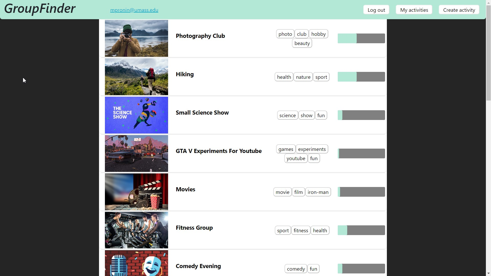

# groupfinder-webapp
GroupFinder allows users to form groups of interests. Users can create an activity and attach an image, description, and other details. Other users can then click the join button to show their interest and add comments.
# Render Link (Cloud Application Hosting): https://groupfinder-webapp.onrender.com/

# Screenshots:

